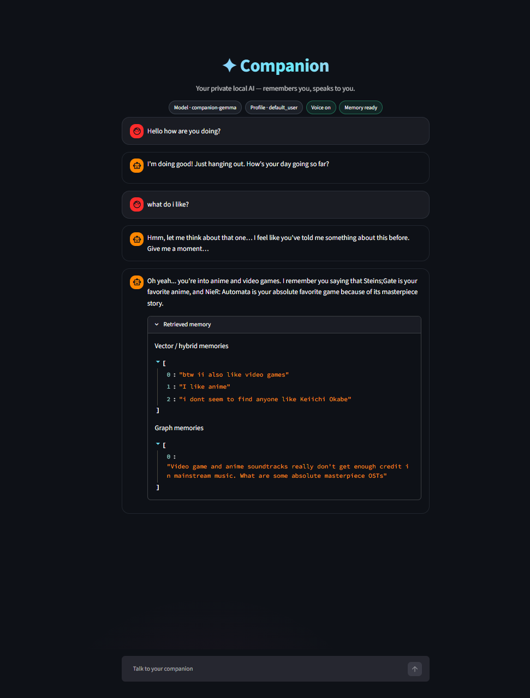
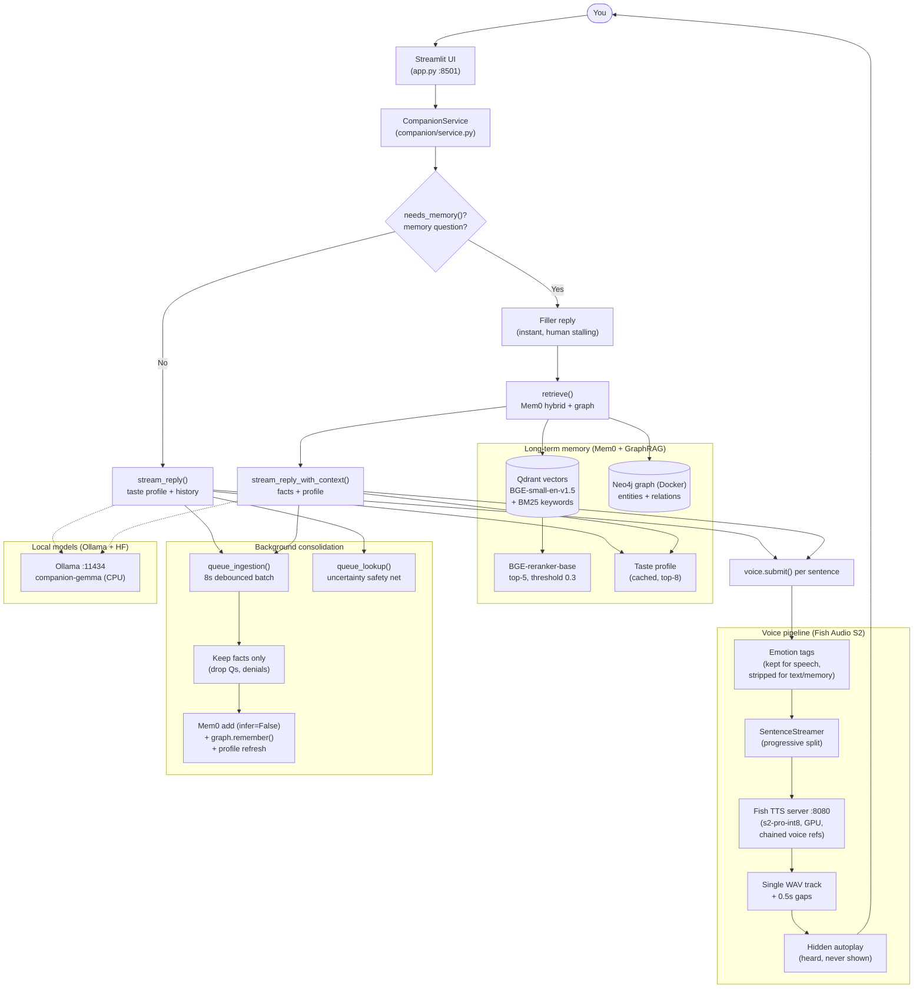
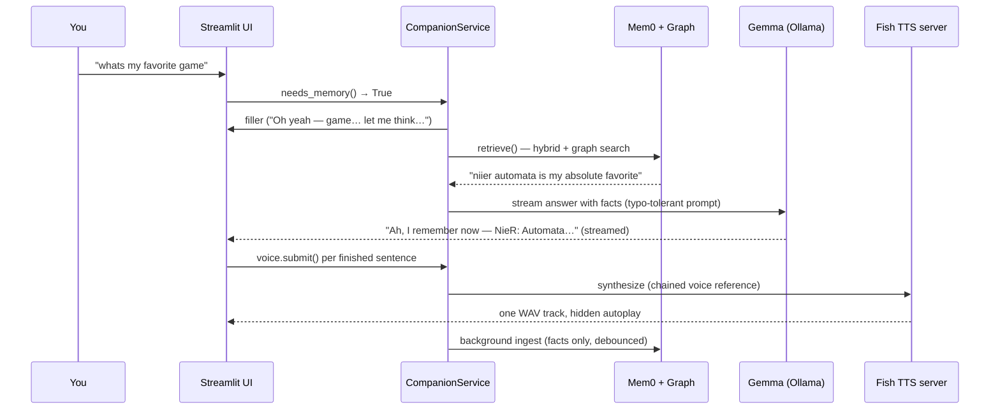

# ✦ GraphRAG Conversational AI


> A private, local AI companion that **remembers you like a person does** — not like a chatbot with a context window. It chats, recalls your tastes mid-conversation, and speaks its replies aloud with expressive voice.

<!-- ============================================================
     SCREENSHOT SLOT 1 — main UI
     Attach your screenshot as: docs/images/ui-screenshot.png
     Suggested capture: a mid-conversation Streamlit window showing
     the hero header, a memory-grounded answer, and the sidebar.
============================================================ -->


---

## Why this exists

Most chatbots are goldfish: every session starts from zero, and anything outside a small context window is forgotten. Humans don't work that way — we consolidate the day into long-term memory while we sleep, keep a living model of the people we know, and recall the right detail at the right moment without being asked twice.

**GraphRAG Conversational AI** is built around that idea. Every conversation is digested into durable, structured memory, and every reply is generated with that memory in context. Ask it your favorite game weeks later — it answers from memory, and connects new topics to old tastes on its own ("given you're a NieR fan, of course you'd like Okabe").

Everything runs **100% on your machine**: the chat model, the memory store, the embeddings, the reranker, and the voice. No cloud, no API keys, no telemetry (Mem0 telemetry is explicitly disabled in code).

---

## Capabilities

- 💬 **Natural companion chat** — warm, opinionated, texting-style persona; streams word-by-word like a real conversation.
- 🧠 **Human-like long-term memory** — durable facts, a relationship graph, and a taste profile that persist across restarts.
- 🔍 **Lookup-first recall** — memory questions check the store *before* answering, so it never guesses and corrects itself later.
- 🕸️ **GraphRAG retrieval** — vector + keyword hybrid search fused with Neo4j entity-graph expansion, reranked for relevance.
- 🗣️ **Expressive voice** — replies are spoken aloud with emotion tags (`[excited]`, `[sigh]`, …), one continuous track per reply, no visible player.
- ⚡ **Fast by design** — debounced background writes, cached taste profile (zero per-turn retrieval cost), relevance thresholds so empty memory returns instantly.
- 🛡️ **Memory hygiene** — questions, assistant chatter, and denials are never stored; pollution can be cleaned automatically.

---

## Memory that works like a brain

The memory system is deliberately modeled on how human memory works — separate stores with different jobs, plus an offline consolidation step:

| Human memory | This project | Where it lives |
|---|---|---|
| Working memory (what's on your mind right now) | Last 12 turns of chat history | In the prompt (`_clean_history`) |
| Episodic + factual memory (things that happened / are true) | Mem0 facts: dense vectors + BM25 keywords + history log | Qdrant (`companion_data/qdrant/`) + `mem0_history.db` |
| Associative semantic network (how things connect) | Neo4j entity/relationship graph with weighted edges | Docker (`companion-neo4j`, bolt `:7687`) |
| Implicit preference memory (tastes you don't restate) | Taste profile: top likes/favorites, refreshed on change | Cached in service, injected every turn |
| Sleep consolidation (filter + file away the day) | 8s debounced batch writes; questions/denials rejected; typo-tolerant normalization | `queue_ingestion` → `_flush_after_idle` |
| Metacognition ("do I actually know this?") | Memory-first routing + uncertainty-triggered background lookup | `needs_memory` / `should_lookup` |

<!-- ============================================================
     IMAGE SLOT 2 — brain/memory mapping diagram
     Attach your diagram as: docs/images/memory-brain-map.png
     Suggested content: side-by-side mapping of brain regions to the
     stores in the table above (working / episodic / graph / profile).
============================================================ -->


---

## How it works

### System architecture



### A memory question, step by step



<!-- ============================================================
     IMAGE SLOT 3 — Neo4j graph nodes
     Attach your screenshot as: docs/images/graph-nodes.png
     Suggested capture: Neo4j Browser (http://localhost:7474) showing
     your Entity/RELATES graph, e.g. user —like→ anime.
============================================================ -->


---

## Use cases

- 🏡 **A companion that knows you** — tastes, hobbies, favorites remembered across months, woven into conversation unprompted.
- 🎮 **Taste-aware recommendations** — games, anime, music, movies suggested from your actual profile, not generic lists.
- 📓 **Personal journaling partner** — tell it things once ("I prefer tea"), ask back anytime.
- 🗣️ **Hands-free chat** — full voice in/out loop for cooking, driving, accessibility.
- 🧪 **Local RAG playground** — the original `rag_system/` document pipeline (ingest → chunk → TF-IDF + embeddings → ChromaDB) is included for experimenting with document-grounded answers (legacy scaffold; needs `chromadb`, `scikit-learn`, `joblib` installed separately).
- 🔬 **Memory research sandbox** — denial filtering, taste distillation, typo-tolerant QA prompts, and GraphRAG fusion are small, readable modules you can ablate.

---

## Project structure

```text
GraphRAG-Conversational-AI/
├── app.py                    # Streamlit UI: chat, hero, pills, hidden voice
├── companion/
│   ├── service.py            # Chat + memory orchestration (CompanionService)
│   ├── graph_neo4j.py        # Neo4j entity/relationship graph (active)
│   ├── graph_memory.py       # Legacy SQLite graph (migration source only)
│   ├── voice.py              # Sentence streaming, TTS client, track builder
│   └── settings.py           # Paths, ports, model locations
├── rag_system/               # Original document RAG pipeline (ingest/chunk/retrieve)
├── scripts/
│   └── migrate_sqlite_to_neo4j.py  # One-off SQLite → Neo4j reseed
├── docs/images/              # Screenshots & diagrams (attach yours here)
├── docker-compose.yml        # Neo4j in Docker (persistent volume)
├── Modelfile                # Ollama model definition (CPU-pinned, 4k ctx)
├── requirements.txt
└── README.md
```

---

## Models

All models run locally. Large weights are **not** in git — download them once into `Models/`:

| Model | Source | Local path | Used for |
|---|---|---|---|
| Gemma 4 12B IT (Q8 GGUF) | supplied file | `Models/gemma-4-12b-it-uncensored-Q8_0.gguf` | Conversation (`companion-gemma` via Ollama) |
| BGE-small-en-v1.5 | `BAAI/bge-small-en-v1.5` | `Models/bge-small-en-v1.5` | Memory embeddings (384-dim) |
| BGE-reranker-base | `BAAI/bge-reranker-base` | `Models/bge-reranker-base` | Reranking candidates |
| Fish Audio S2 Pro INT8 | `Imagilux/fishaudio-s2-pro` | `Models/s2-pro-int8` | Voice synthesis (GPU) |
| spaCy `en_core_web_sm` | `python -m spacy download en_core_web_sm` | environment | Entity extraction for hybrid search |

---

## Setup

Prerequisites: Python 3.10+, [Ollama](https://ollama.com), [Docker Desktop](https://www.docker.com/products/docker-desktop/) (for Neo4j), an NVIDIA GPU for voice (CPU-only chat), ~25GB disk for models.

```powershell
# 1. Environment
pip install -r requirements.txt
python -m spacy download en_core_web_sm

# 2. Chat model (from the project root)
ollama serve
ollama create companion-gemma -f Modelfile

# 3. Voice server (separate env; see fish-speech docs for the one-time setup)
#    Needs: fish-speech checkout + CUDA torch + Models/s2-pro-int8
.\voice_env\Scripts\python.exe vendor\fish-speech\tools\api_server.py --llama-checkpoint-path Models\s2-pro-int8 --decoder-checkpoint-path Models\s2-pro-int8\codec.pth --listen 0.0.0.0:8080

# 4. Graph memory (Docker)
docker compose up -d
python scripts/migrate_sqlite_to_neo4j.py   # one-off reseed, safe to re-run
# browse the graph at http://localhost:7474 (user neo4j)

# 5. UI
streamlit run app.py
# open http://localhost:8501
```

Ports: UI `8501` · Ollama `11434` · voice `8080` · Neo4j bolt `7687` + browser `7474`. Each memory profile (sidebar) is isolated; clearing the chat display never erases long-term memories. Set `voice_reference_id` in settings with a 10–30s voice clip for a fixed companion voice.

---

## Configuration highlights

- `companion/settings.py` — model paths, ports (`8501`/`8080`/`11434`), Neo4j connection (`bolt://localhost:7687`, database `neo4j`), collection name, per-profile isolation.
- `Modelfile` — `num_gpu 0` pins chat to CPU (GPU belongs to voice), 4k context, 256-token cap.
- Retrieval: top-5, 0.3 threshold, 12-turn history window, 8s ingestion debounce — all tunable in `service.py`.

---

## Roadmap

- [ ] Reference-voice cloning from a short sample (`voice_reference_id`)
- [ ] Multi-speaker turns and voice emotions dashboard
- [ ] Memory inspector UI (browse/edit/delete facts)
- [ ] Document RAG wired into chat context (`rag_system/` ↔ companion)
- [x] Docker Compose setup for Neo4j (persistent volume, auto-restart)

---

## License & credits

- Project code: yours to use and extend.
- [Mem0](https://github.com/mem0ai/mem0) is Apache-2.0.
- Fish Audio S2 Pro weights use the **Fish Audio Research License** (research/non-commercial; commercial use needs a license from Fish Audio).
- Built with Ollama, Streamlit, Qdrant, Sentence-Transformers, and fish-speech.
